[Documentation](index) > [Using The Console](console)

## Connecting To the Broker

### Adding A Connection

Once you have navigated to the *Connect* page click on the *Add connection* button and fill in the Jolokia endpoint configuration
of your broker.

The endpoint details will depend on your specific broker configuration, but can be easily found in a message printed to
the console during broker startup. For instance, a fresh broker instance displaying startup message:

    AMQ241002: Artemis Jolokia REST API available at http://localhost:8161/console/jolokia

Would yield connection details of:

    Host: localhost
    Port: 8161
    Path: /console/jolokia

Configure these as needed for your specific broker instance. You can test the connection with the *Test connection* button before clicking *Add* to save the connection:
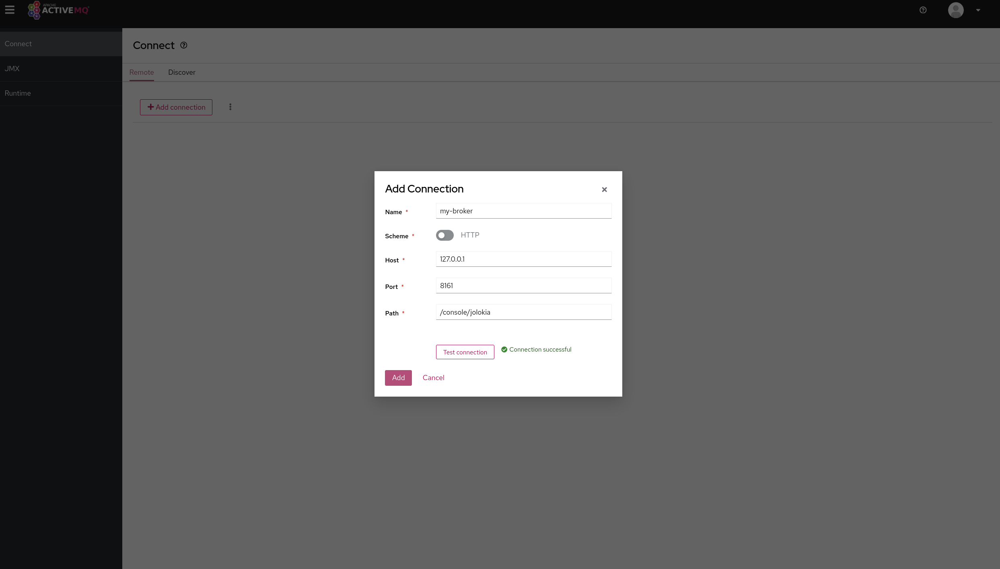

Once the connection is added simply click the *Connect* button for your broker and this should open up a new tab and prompt for a login attempt.
Once logged in you should see the console with two Artemis menu items.

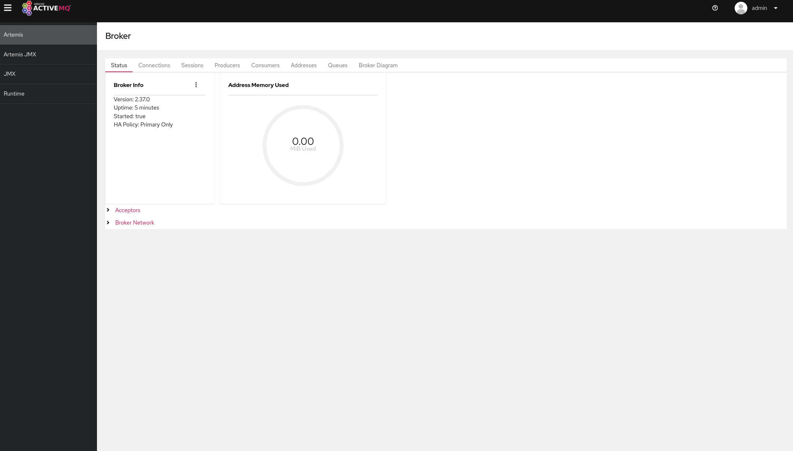

## Navigating the Artemis Views

There are two Artemis views that are available from the left hand menu the **Artemis** view and the **Artemis JMX** view.

The [**Artemis JMX**](#artemis-jmx-view) view navigates around resources using a JMX tree and presents the JMX Attributes and Operations of each specific MBean as well as functionality exposed.

The [**Artemis**](#artemis-view) view is a set of tabs that exposes functionality in tabular views for paginating over broker resources such as Addresses and Queues.

### Artemis JMX View
Click **Artemis JMX** in the left navigation bar to see the Artemis JMX specific plugin. (The Artemis tab won’t appear if there is no 
broker in this JVM). The Artemis plugin works very much the same as the JMX plugin however with a focus on interacting with an Artemis broker.

#### Tree View
The tree view on the left-hand side shows the top level JMX tree of each broker instance running in the JVM. Expanding 
the tree will show the various MBeans registered by Artemis that you can inspect via the Attributes tab. When a specific 
MBean is selected in the tree a set of related tabs become visible

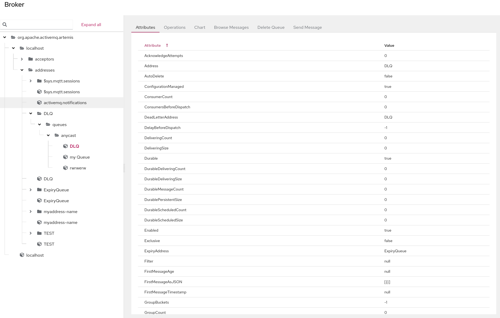

#### Default Tabs

All MBeans will show the following tabs by default which are exposed on all MBeans.

##### Attributes

The **Attributes** tab shows all attributes that are configured on an MBean if permissions allow. Depending on the permissions of the user
these may be editable.

##### Operations

The **Operations** Tab exposes a list of JMX operations that the selected MBean exposes. Depending on a users permissions
these can be executed by expanding each operation.

##### Chart

The **Chart** tab allows you to view numerical data of an MBean along a time series.

#### Address Tabs

If the MBean selected is an Address MBean which are found under the *addresses* leaf in the tree then you will see the following tabs if permissions allow.

##### Create Queue

This tab will allow the user to create queues that are bound to the address that is selected. It exposes the ability to 
configure a sub set of available parameters on the queue, however extra configuration not exposed  can be configured
using a set of key/value pairs, for instance delay-before-dispatch or auto-delete.

##### Delete Address

The **Delete** tab allows you to delete an address completely. 

> NOTE: The Address can only be deleted if it has no queues and cannot be undone.

##### Send Message

This **Send Message** tab allows the user to send a message to an address, this in turn will route it to any queues that are bound to this address.

It allows message headers to be added and a body. Note that the message type created is always a Text Message.

> NOTE:  The sending of the message will be authenticated using the current logon user, unselect *use current logon user* to use a different user.

#### Queue Tabs

If the MBean selected is a *Queue* MBean then the following tabs are displayed.

> NOTE: Queue MBeans are found under the  *Address* MBean it is bound to.
>

#### Browse Messages



##### Browse a Message

It is possible to view the contents of a message by clicking on the 3 dots to the right of the message and clicking the
*view* button. This will open up a dialog box showing the body, headers and properties of the message.

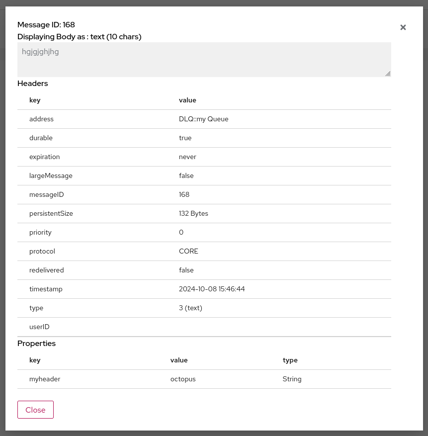

Note that the body of the message may not be viewable if it is not of type Text Message. All other messages are shown as
bytes and will be transformed depending on the **Browse Bytes Messages** setting which can be set in the **preferences**.

> NOTE: large messages are also truncated to protect the browser this can be configured in Artemis [Address Settings](https://activemq.apache.org/components/artemis/documentation/latest/address-settings.html#address-settings)

>NOTE: The columns show can be configured by clicking on the *Manage Columns* link and selecting which columns should be shown.
> The column configuration is persisted to the browsers local storage and will be retrieved for each browser session.

##### Delete Queue

The **Delete Queue** tab allows you to either delete the whole queue or purge messages, that is remove all the messages in the queue.

Both will open a dialog box to confirm the operation. This operation cannot be undone.

##### Send Message

This **Send Message** tab allows the user to send a message directly to a queue, Note that unlike the **Send Message** to 
an address this will bypass any messages routing semantics and be placed directly on the queue.

It allows message headers to be added and a body. Note that the message type created is always a Text Message.

> NOTE:  The sending of the message will be authenticated using the current logon user, unselect *use current logon user* to use a different user.

### Artemis View

Click Artemis in the left navigation bar to see the Artemis specific plugin. (The Artemis tab won’t appear if there is no
broker in this JVM). The **Artemis View** unlike the JMX view is more orientated around paginating over the Brokers resources 
such as Addresses and Queue. The same functionality though is available as in the JMX view. The following tabs are available 
in the Artemis view.

All of the tabs in the **Artemis View** that show tabulated data will allow the user to configure which columns to show. This is persisted in the sessions local storage and available when a new session is started.

#### Status

The **Status** tab is the default tab shown after login and shows the basic state of the broker, including uptime, the 
Address memory used and the type of Broker deployed. It also shows the status of each **Acceptor** configured as well as 
the network status is a cluster of brokers. This Status refreshes every 5 seconds.

#### Connections

The **Connections** tab lists all the connection to the broker. 

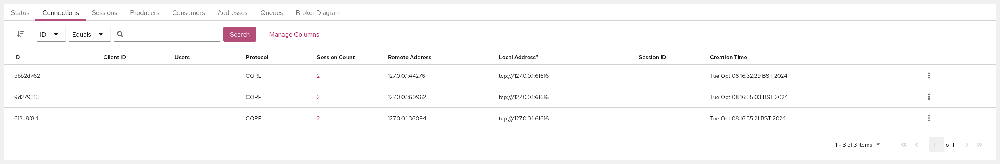

Connections can be ordered by clicking on the sort icon on the top left toolbar, selecting the Column to sort of and choosing 
either *ascending* or *descending*.

The list can also be filtered on multiple columns by choosing a column and operator from the dropdowns and entering a 
value to filter on by clicking the *Search* button.

Clicking on the *Session Count* value will navigate to the **Sessions** tab and automatically filter on the chosen connection.

The Session can be closed if permissions allow by clicking on the 3 dots to the right of the clicking the *close* button.

#### Sessions

The **Sessions** tab will list all the session open on the Broker.

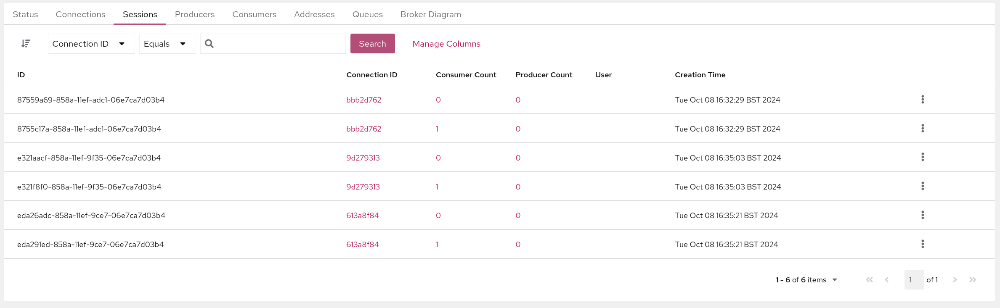

Sessions can be ordered by clicking on the sort icon on the top left toolbar, selecting the Column to sort of and choosing
either *ascending* or *descending*.

The list can also be filtered on multiple columns by choosing a column and operator from the dropdowns and entering a
value to filter on by clicking the *Search* button.

Clicking on the *Connection ID* value will automatically navigate to the **Connections** tab and filter on that connection.

Clicking on the *Consumer Count* will automatically navigate to the **Consumers** tab and filter on the consumer chosen.

Clicking on the *Producer Count* will automatically navigate to the **Producers** tab and filter on the consumer chosen.

The Session can be closed if permissions allow by clicking on the 3 dots to the right of the clicking the *close* button.

#### Producers

The **Producers** tab will list all the producers open on the Broker.

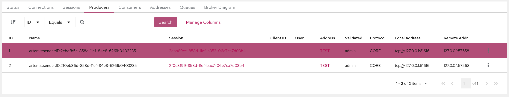

Producers can be ordered by clicking on the sort icon on the top left toolbar, selecting the Column to sort of and choosing
either *ascending* or *descending*.

The list can also be filtered on multiple columns by choosing a column and operator from the dropdowns and entering a
value to filter on by clicking the *Search* button.

Clicking on the *Session* value will navigate to the **Sessions** tab and filter on the session chosen.

Clicking on the *Address* value will navigate to the **Address** tab and filter on that address 

#### Consumers

The **Consumers** tab will list all the Consumers open on the Broker.

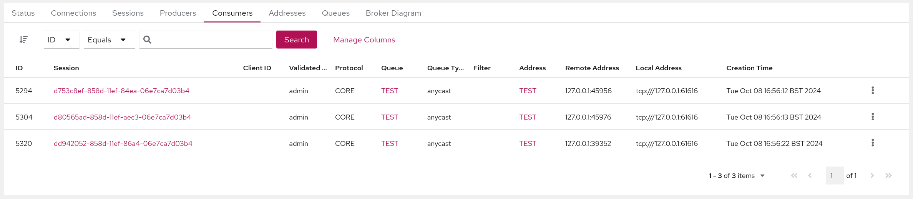

Consumers can be ordered by clicking on the sort icon on the top left toolbar, selecting the Column to sort of and choosing
either *ascending* or *descending*.

The list can also be filtered on multiple columns by choosing a column and operator from the dropdowns and entering a
value to filter on by clicking the *Search* button.

Clicking on the *Session* value will navigate to the **Sessions** tab and filter on the session chosen.

Clicking on the *Address* value will navigate to the **Address** tab and filter on that address 

Clicking on the *Queue* value will navigate to the **Address** tab and filter on that queue 

A consumer can be closed by clicking on the 3 dots to the right of the Consumer and clicking *close*.

#### Addresses

The **Addresses** tab will list all the Address on the Broker.

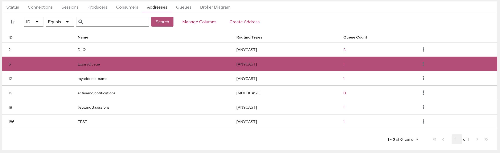

Addresses can be ordered by clicking on the sort icon on the top left toolbar, selecting the Column to sort of and choosing
either *ascending* or *descending*.

The list can also be filtered on multiple columns by choosing a column and operator from the dropdowns and entering a
value to filter on by clicking the *Search* button.

Clicking on the *Queue Count* value will navigate to the **Address** tab and filter on that address 

The 3 dots on the right of each Address will allow the user to perform the following operations.

##### Show in Artemis JMX

This will navigate to the **Artemis JMX** view and automatically select the addresses MBean.

##### Attributes

This will open up a dialog showing all the Queues MBean attributes and allow editing if permissions allow.

##### Operations

This will open up a dialog showing all the Queues MBean operations and allow execution of permissions allow.

##### Delete Address

This will open up a dialog to confirm deletion of the Address if permissions allow.

##### Send Message

This will open up a dialog and allow the user to send a message to this queue if permissions allow.

##### Create Queue

This will open up a dialog and allow the user to send a message to this queue if permissions allow. this in turn will route it to any queues that are bound to this address.

It allows message headers to be added and a body. Note that the message type created is always a Text Message.

> NOTE:  The sending of the message will be authenticated using the current logon user, unselect *use current logon user* to use a different user.

##### Create Queue

This will open up a dialog which will allow the user to create queues that are bound to the address that is selected. It exposes the ability to
configure a sub set of available parameters on the queue, however extra configuration not exposed  can be configured
using a set of key/value pairs, for instance delay-before-dispatch or auto-delete.

#### Queues

The **Queues** tab will list all the Address on the Broker.

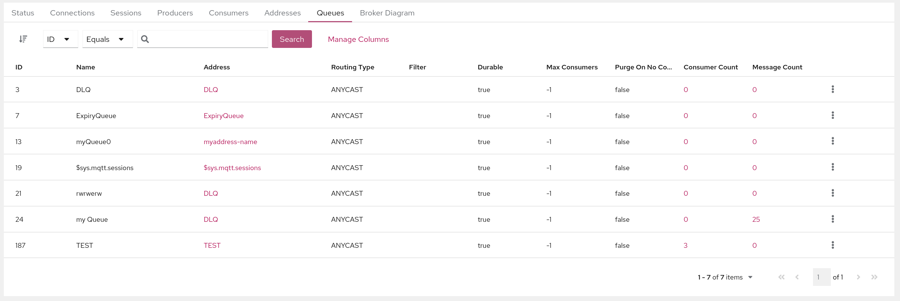

Queues can be ordered by clicking on the sort icon on the top left toolbar, selecting the Column to sort of and choosing
either *ascending* or *descending*.

The list can also be filtered on multiple columns by choosing a column and operator from the dropdowns and entering a
value to filter on by clicking the *Search* button.

Clicking on the *Address* value will navigate to the **Addresses** tab and filter on the address chosen.

Clicking on the *Consumer Count* value will navigate to the **Consumers** tab and filter on the queue chosen.

Clicking on the *Message Count* value will show a different view allowing the user to browse messages.



From the browse view of this tab you can then browse a single message by clicking on the 3 dots to the right of the message and clicking the *view* button.
This will then change the view to:

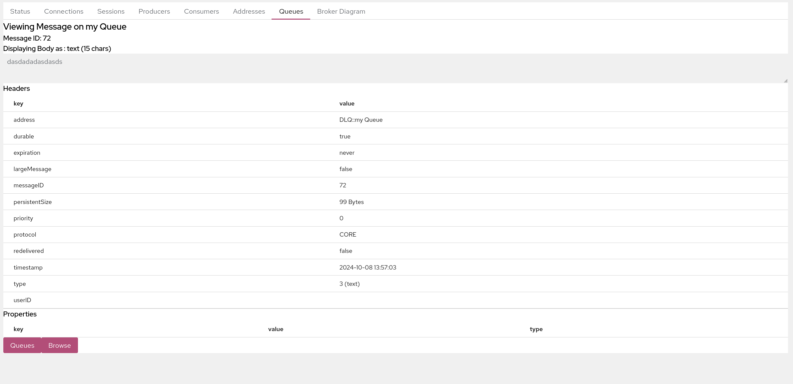

> NOTE: You can navigate to and from each view by using the *Queues* and the *Browse * button at the bottom left hand corner.

#### Broker Diagram

The **Broker Diagram** tab shows a visual representation of the Broker, its Addresses and Queue and any other Broker that
may be in the Cluster. You can choose which Nodes to show by clicking on the *Node Options* dropdown.

Clicking on the node will also fetch up the Attributes of the MBean associated with the node.

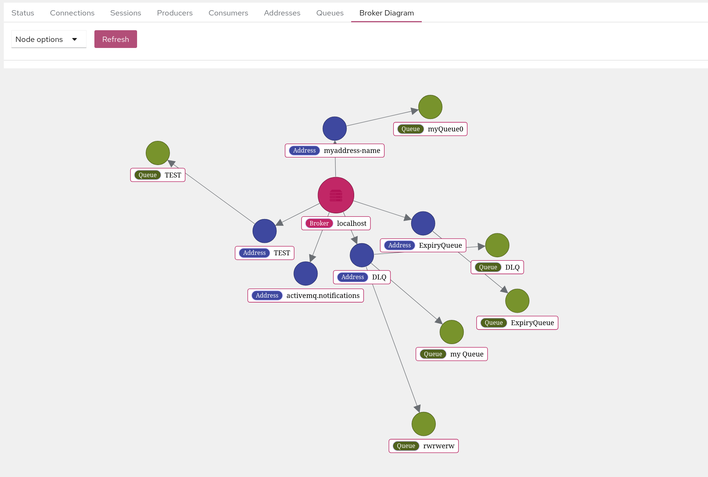

### Security

#### Jolokia Access

The Jolokia JMX-HTTP bridge is secured via a policy file in the broker configuration directory: 'etc/jolokia-access.xml'. 
The contents of that file should be modified as described in the [Jolokia Security Guide](https://jolokia.org/features/security.html). 
By default the console is locked down to 'localhost', pay particular attention to the 'CORS' restrictions when exposing the console web endpoint over the network.

#### MBean Access

Access to MBeans is configured in ActiveMQ Artemis, see the [Management via JMX](https://activemq.apache.org/components/artemis/documentation/latest/management.html#management-via-jmx) chapter.

Certain screen and tab visibility is controlled by the access to a specific JMX Operation, for instance the **Create Queue** 
tab is only shown if the user has access to the create queue JMX operation.

### Single Sign on

Please refer to the [HawtIO Documentation](https://hawt.io/docs/oidc.html)

